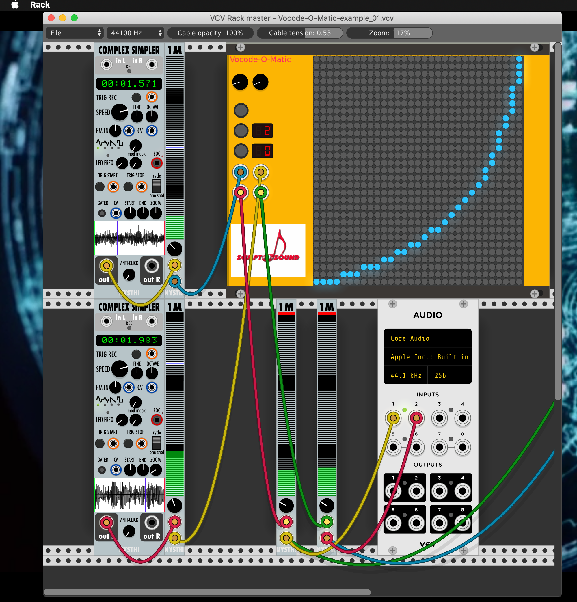

# VCV vocoder plugin
# Copyright: Zaphod B. 2018, 2019

Sculpt-O-Sound presents: 

Vocode-O-Matic, v0.3 is a 31 terts band vocoder with editable frequency matrix usable for 44100 Hz sampling frequency only (at the moment).

The vocoder has 31 terts band filters for the carrier and modulator inputs.
The carrier input is the top left of the connectors, the modulator the top right.
The L and R outputs are immediately below the inputs.
To get an interesting result, start by using a pad like sound with a big bandwidth as a carrier and
a rhythm loop as a modulator. You should hear the pad play the rhythm.
The vocoding effect heavily depends on the link of the filter bands. I.e. which modulator band is modulating which carrier band.
In the modulation matrix you can choose this by toggling the link between the bands.
Vocode-O-Matic comes with 5 presets. Mode 4 is the linear mode (default), 5 is inverse, and 0, 1, 2 and 3 are variants of a logaritmic coupling between the filter bands (see also "Buttons" below).

Example

Try for example the files fl1_std.wav (string from a Kurzweil K2000) and jung05.wav (a jungle loop from some sample kit).
You can play them via a sample player like complex simpler from the NYSTHI plugin set.
For your convenience Vocode-O-Matic-example_01.vcv will load the appropriate files.
Make sure the top simpler loads the fl2.wav file and the bottom one the jung05.wav file.
Have a look at the screen shot below if you need some help.

For reasons unclear to me when using the example setup file often the same file is read into both simplers which does not make much sense. As a remedy read in the audio files explicitely and you'll be fine. In the patch click on the trigger button left of the 'start' input on both Simplers. The files should be played as loops then. The vocoder will be in linear mode which is numbered 4. As a result the energy in the low frequency bands of the modulator will modulate the energy in the low frequency bands of the carrier. The energy in the mid frequency bands of the modulator will modulate the energy in the mid frequency bands of the carrier and the energy in the high frequency bands of the modulator will modulate the energy in the high frequency bands of the carrier. You'll hear the summed signal from all frequency bands. To get some stereo effect the even and odd bands are summed up separately and panned. The sum effect will be that you will hear a string section play in the rhythm of the beat loop.

If you click the button left of the first 7 segment display, this is the filter mode number, you will select the next modulation mode. Number 5 will invert the filter matrix resulting in the low frequencies of the carrier being modulated by the energy in the high frequencies of the modulator signal, the mid frequencies of the carrier being modulated by the energy in the mid frequencies of the modulator signal and the high frequencies of the carrier being modulated by the energy in the low frequencies of the modulator signal. There are a few more modes. You can cycle through them by repeately clicking the mode button. Each will result in a different modulation topology.

Obviously you can also use the vocoder in a real time setting by connecting the carrier and modulator input to a real time sound source e.g. your audio device (put carrier signal on one channel and modulator signal on the second channel of your audio device's line input) a source in VCV-rack. Note that you can draw whatever modulation topology you like by clicking the toggle switches of the matrix directly.

Knobs and Toggle switches

The knobs on top of the rack element are attenuators for the carrier and modulator input signals.
The filter matrix consists of toggle switches, so you can make your own coupling between modulator and carrier filters.
Mind you, no attenuation is done, so if you combine a lot of modulator bands with one carrier filter, the output of the filter
may exceed the maximum sample value (voltage) allowed resulting in distortion. 

Buttons

The top toggle button when pressed will turn red, this will put the vocode in bypass mode. 
This will send the modulator and carrier input signals to the left and right outputs respectively.

The second toggle button from the top lets you choose between 5 filter mappings. Number 4 is a linear mapping of the modulator filters
against the carrier filters. This is the default at startup. Number 5 is a reverse mapping. 
Mapping 0, 1, 2, 3 and log mappings. All sound differently. And by toggling switches in the matrix you can change them.

The third button does some matrix magic. It will shift the filter mapping to the right in a slow pace. The 7 segment display will show the position of the matrix. If you press the button again the matrix will stop moving.

Known bugs

Since I'm relatively new to C++ programming and the Rack VCV platform I probably have not initialized all elements properly.
What I've found is that the vocoder on occasion will only output a DC value, and not produce any other sound at all.
Restarting Rack or opening the module once more will often solve this problem. If anyone knows how to handle this properly,
please let me know.

All filters are based on the series of tutorial papers about Effect Design by Jon Dattorro published in the Journal of the Audio Engineering Society (https://ccrma.stanford.edu/~dattorro/EffectDesignPart1.pdf).
