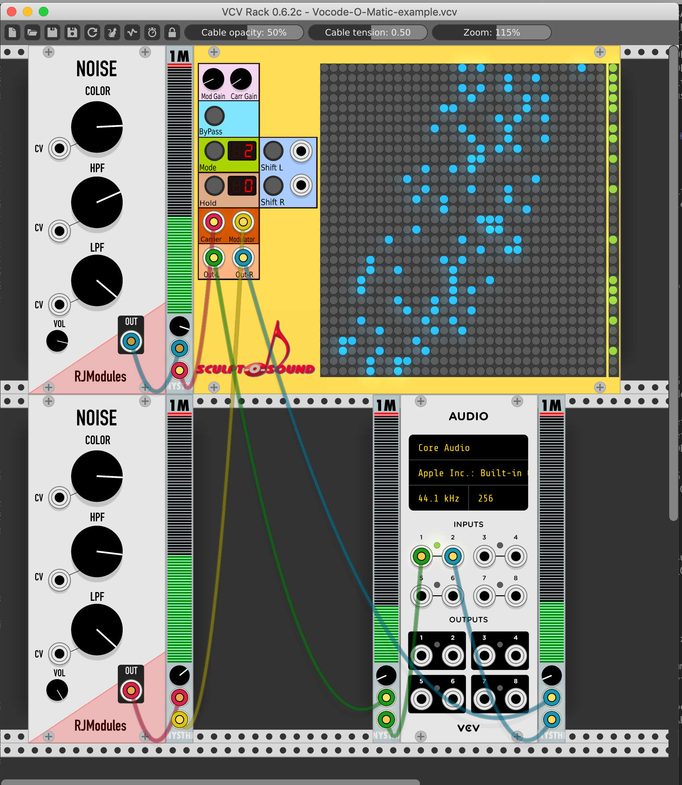

# VCV vocoder plugin
# Copyright: Zaphod B. 2018, 2019

Sculpt-O-Sound presents: 

Vocode-O-Matic, v0.4 is a 31 terts band vocoder with editable frequency matrix usable for 44100 Hz sampling frequency only (at the moment).

The vocoder has 31 terts band filters for the carrier and modulator inputs.
To get an interesting result, start by using a pad like sound with a big bandwidth as a carrier and
a rhythm loop as a modulator. You should hear the pad play the rhythm.

Signal flow
===========
The modulator signal is fed into the matrix from the bottom of the matrix anddevided into 31 frequency bands. So each column corresponds to a band of the modulator. The carrier signal is fed into the matrix from the left. So each row corresponds to a frequency band or the carrier. Buttons pressed in the matrix will allow the corresponding column's modulator band energy to modulate the corresponding row's carrier band signal. All modulated carrier signals are summed and send to 2 outputs. The sum of the modulated even bands is send to the Left output, the sum of the modulated odd bands to the Right output.

The frequency is lowest at the lower left side of the matrix. Bands more to the right or up are higher in frequency.

To make it easy for users Vocode-O-Matic comes with 5 presets. Mode 4 is the linear mode (default), 5 is inverse, and 0, 1, 2 and 3 are variants of a logaritmic coupling between the filter bands (see also "Buttons" below). The chosen modulation will be saved in the patch file. You can also choose to save the settings as a preset.

Inputs
======
Obviously there is an input for the carrier signal and one for the modulator signal.
A trigger puls to the Shift L input will shift the buttons of the matrix one position to the left with wrap around.
The Shift R trigger input will shift the matrix in the opposite direction.

Outputs
=======
There is a Left and a Right output. The vocoder produces a semi stereo signal although the input signals are mono. This is done by sending the summed effect of the odd modulator channels and the even modulator channels on the carrier to the left and right outputs respectively.

Knobs
=====
The rotary knobs on top of the rack element are gain buttons for the carrier and modulator input signals.

Matrix buttons
==============
The filter matrix consists of toggle switches, so you can make your own coupling between modulator and carrier filters.
Mind you, no attenuation is done, so if you combine a lot of modulator bands with one carrier filter, the output of the filter
may exceed the maximum sample value (voltage) allowed resulting in distortion. 

Matrix mode button
==================
The mode toggle button lets you choose between 5 filter mappings. Number 4 is a linear mapping of the modulator filters
against the carrier filters. This is the default at startup. Number 5 is a inverse mapping. 
Mapping 0, 1, 2, 3 are log mappings. All sound differently. And by toggling switches in the matrix you can change them.

Shift L R buttons
=================
The shift L and shift R buttons allow you to manually shift the matrix one step left and right respectively. The display will show the shift position. The inputs next to these buttons will do the same if a pulse signal is fed to them.

Hold button
===========
The hold button will stop the effect of the pulse to the inputs, effectively holding the matrix in its position. The 7 segment display will show the position shift of the matrix. 0 is the initial state, 30 means the matrix has shifted completely to the right (with wrap around).

Mute buttons
============
On the right hand side of the filter matrix for every frequency band of the carrier a mute buttons is shown. By default all outputs are active i.e. no band is muted (lights are green). If you toggle a button the light will go out and the corresponding carrier signal will not be added to the output signal.

Bypass button
=============
The bypass toggle button when pressed will turn red, this will put the vocoder in bypass mode. 
This will send the modulator and carrier input signals to the left and right outputs respectively.
If you use the Vocode-O-Matic-example.vcv settings file make sure you hear the string sample and the drum loop in bypass mode. If not, reload the samples in the simpler modules.

Sources
=======
All filters are based on the series of tutorial papers about Effect Design by Jon Dattorro published in the Journal of the Audio Engineering Society (https://ccrma.stanford.edu/~dattorro/EffectDesignPart1.pdf).

Example
=======

Try for example the files fl1_std.wav (string from a Kurzweil K2000) and jung05.wav (a jungle loop from some sample kit).
You can play them via a sample player like complex simpler from the NYSTHI plugin set.
Make sure the carrier simpler loads the fl2.wav file and the modulator simpler the jung05.wav file.

Known bugs
==========
Since I'm relatively new to C++ programming and the Rack VCV platform I probably have not initialized all elements properly.
What I've found is that the vocoder on occasion will only output a DC value, and not produce any other sound at all.
Restarting Rack or opening the module once more will often solve this problem. If anyone knows how to handle this properly,
please let me know.

Request
=======
Please let me know if you have used Vocode-O-Matic in your music (send me a link or a mp3 file). I'm very curious to hear how people use it.

Changelog
=========
v0.4 
    - internal state and parameter settings are saved.
    - outputs can be muted
    - added text to the front panel
