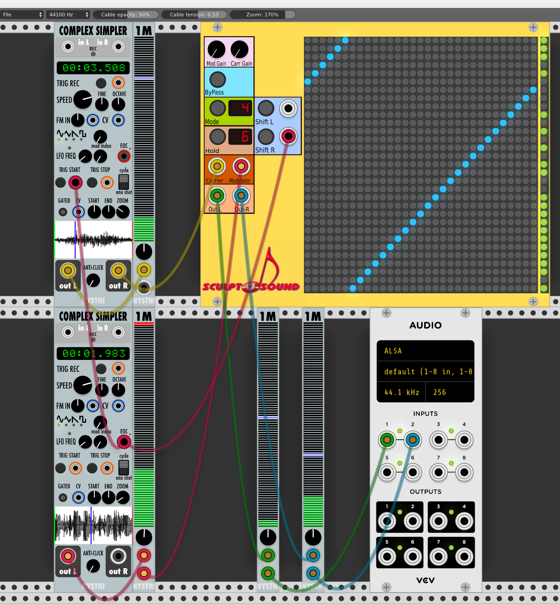
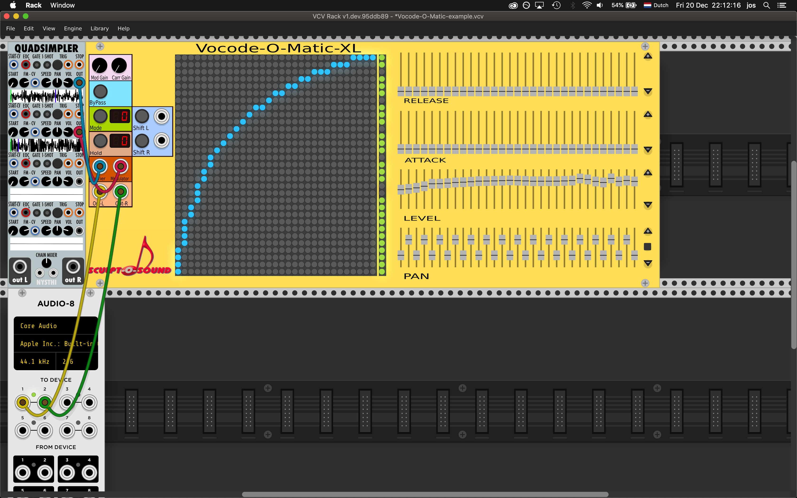

# VCV vocoder plugin for vcvrack
# Copyright: Zaphod B. 2018

Sculpt-O-Sound presents:

Vocode-O-Matic and Vocode-O-Matic-XL, are 31 terts band vocoders with editable frequency matrix for Rack v1.x.
Its use is restricted to 44100 Hz sampling frequency at the moment. The actual vocoding done by Vocode-O-Matic and Vocode-O-Matic-XL are the same. The XL-version has more controls which allow fine tuning of the output signal. 
You can find a video posted on youtube which demonstrates Vocode-O-Matic. Follow this link: https://www.youtube.com/watch?v=u_tcVmCJ_R8
A second video demonstrating some of the fine tuning capabilities of Vocode-O-Matic-XL can be found here:

The vocoder has 31 terts band filters for the carrier and modulator inputs.
To get an interesting result, start by using a pad like sound with a large bandwidth as a carrier and a rhythm loop as a modulator. The vocoder will make the pad play the rhythm.

Vocode-O-Matic-XL is basically the same as Vocode-O-Matic but it has sliders for the level of the modulator bands, sliders for panning the vocoded carrier bands to either left or right and sliders for the attack and release time of the envelope follower of each terts band. Be careful with the level sliders. If you crank them up too much, the sound will be distorted.

Signal flow
===========
The modulator signal is split into 31 frequency bands which are fed into the matrix on the left hand side of the matrix. The center frequency of the band pass filters used goes up from the bottom to the top of the matrix. So each row corresponds to one of 31 bands. The carrier signal is fed into the matrix from the bottom (frequencies go up from left to right) and split into 31 terts bands as well. So each column corresponds to a frequency band or the carrier. Buttons pressed in the matrix will allow the corresponding row's modulator band energy level to amplitude modulate the corresponding column's carrier band signal. The energy level of the modulator signal is computed using an envelope follower (which in Vocode-O-Matic has a set attack time and release time. In the XL version you can set the attack times using sliders.). All modulated carrier signals are summed and send to 2 outputs. In Vocode-O-Matic the sum of the modulated even bands is send to the Left output, the sum of the modulated odd bands to the Right output. In Vocode-O-Matic-XL you can pan each band to Left or Right using the corresponding pan slider. At the right hand side of the matrix are mute buttons. They allow muting modulator bands thus excluding their effect on the carrier bands.

The frequency is lowest at the lower left side of the matrix. Bands more to the right or up are higher in frequency.

To make it easy for users Vocode-O-Matic comes with 5 presets. Mode 4 is the linear mode (default), 5 is inverse, and 0, 1, 2 and 3 are variants of a logaritmic coupling between the filter bands (see also "Buttons" below). The chosen modulation will be saved in the patch file. You can also choose to save the settings as a preset.

Inputs
======
Obviously there is an input for the carrier signal and one for the modulator signal.
A trigger pulse to the Shift L input will shift the buttons of the matrix one position to the left with wrap around.
A trigger pulse applied to the Shift R trigger input will shift the matrix in the opposite direction.

Outputs
=======
There is a Left and a Right output. The vocoder produces a semi stereo signal although the input signals are mono. This is done by sending the summed effect of the odd modulator channels and the even modulator channels on the carrier to the left and right outputs respectively.

Knobs
=====
The rotary knobs on top of the rack element are gain buttons for the carrier and modulator input signals. Be careful with them, if you turn them up too much. the vocoder output signal will be distorted.

Matrix buttons
==============
The filter matrix consists of toggle switches, so you can make your own coupling between modulator and carrier filters. If you right click on a button and right click on another button once more, all buttons between these will be pressed. This makes it easier to press a series of buttons.
Mind you, no attenuation is done, so if you combine a lot of modulator bands with one carrier filter, the output of the filter
may exceed the maximum sample value (voltage) allowed resulting in distortion.

Matrix mode button
==================
The mode toggle button lets you choose between 5 filter mappings. Number 4 is a linear mapping of the modulator filters
against the carrier filters. This is the default at startup. Number 5 is an inverse mapping.
Mapping 0, 1, 2, 3 are log mappings. All sound differently. By toggling switches in the matrix you can change them.

Shift L R buttons
=================
The shift L and shift R buttons allow you to manually shift the matrix one step to the left and to the right respectively. The display will show the shift position's number. The inputs next to these buttons will do the same if a pulse signal is fed to them.

Hold button
===========
The hold button will stop the effect of the pulse to the inputs, effectively holding the matrix in its position. The 7 segment display will show the position shift of the matrix. 0 is the initial state, 30 means the matrix has shifted completely to the right (with wrap around).

Modulator activation buttons
============================
On the right hand side of the filter matrix for every frequency band of the modulator a button is shown which can be used to (de)activate a modulator band. By default all modulator bands are active (lights are green). If you toggle a button the light will go out and the corresponding modulator band will not add to the vocoder effect. If you right click on a button all buttons will be switched to non active except the one you clicked effectively soloing the corresponding modulator band's effect on the carrier signal. You can then reactivate other modulator bands by left clicking on them. If you right click once more, the modulator activation buttons will return to the state befor you first right clicked.

Bypass button
=============
The bypass toggle button when pressed will turn red, this will put the vocoder in bypass mode.
This will send the carrier and modulator input signals to the left and right output respectively.
If you use the Vocode-O-Matic-example.vcv settings file make sure you hear the string sample and the drum loop in bypass mode. If not, reload the samples in the simpler modules.

Sliders, Vocode-O-Matic-XL only
===============================
Pan: allows you to pan a carrier band from the left to the right channel.
The three macro buttons on the right hand side of the sliders can be used to increase the pan width, center the panning or decrease the pan width. These buttons work on all pan sliders at once.
Level: allows you to amplify a band's modulator signal. 
The two macro buttons on the right hand side of the sliders can be used to opearate all level sliders at once, either pushing them up or down.
Attack: allows you to choose the attack time of the envelope follower for the corresponding modulator band. 
The two macro buttons on the right hand side of the sliders operate on all sliders at once. They can be used to increase or decrease the attack time.
Release: allows you to choose the release time of the envelope follower for the corresponding modulator band.
The two macro buttons on the left hand side of the sliders operate on all sliders at once. They can be used to increase or decrease the release time.

Sources
=======
All filters are based on the series of tutorial papers about Effect Design by Jon Dattorro published in the Journal of the Audio Engineering Society (https://ccrma.stanford.edu/~dattorro/EffectDesignPart1.pdf).

Aknowledgements
===============
I am deeply indebted to Jerry Sievert and Netboy3 for their help in porting the Rack v0.6 version of Vocode-O-Matic to the v1.x standard. Thanks a lot! And of course I am indebted to the late Jon Dattorro whos publications inspired me to start writing signal processing code for musical applications.

Example
=======
Try for example the files fl1_std.wav (string from a Kurzweil K2000) and jung05.wav (a jungle loop from some sample kit).
You can play them via a sample player like complex simpler from the NYSTHI plugin set.
Make sure the carrier simpler loads the fl2.wav file and the modulator simpler the jung05.wav file.
I posted a video on youtube which demonstrates this. You can find it here: https://www.youtube.com/watch?v=u_tcVmCJ_R8

Known bugs
==========
None at the moment. But please let me know if you find any, or if you wish me to add any features.

Request
=======
Please let me know if you have used Vocode-O-Matic in your music (send me a link or an mp3 file). I'm very curious to hear how people use it.

License
=======
All **source code** is copyright © 2018 Jos Bouten and is licensed under the [GNU General Public License v3.0](gpl-3.0.txt).
All **graphics** in the `res` directory are copyright © 2018 Jos Bouten and licensed under [CC BY-NC-ND 4.0](https://creativecommons.org/licenses/by-nc-nd/4.0/).
